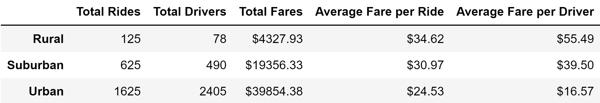

# PyBer Analysis
## Overview 

### Background
Previously, an exploratory analysis was done for the ride-sharing company PyBer. After the completion of that project, additional analyses were requested.  

### Purpose
The purpose of the current project was to create a dataframe that contained a summary of the ride-sharing data by city type, and then create a line graph to visualize the total weekly fares for each city type. The results from this project are intended to help PyBer to make informed business decisions going forward. 

## Results
**Urban Cities**

Urban cities have the greatest total rides, drivers, and fares out of the three city types. However, they have the lowest average fare per ride and per driver. 

**Suburban Cities** 

Suburban cities occupy the middle ground in every category analyzed.

**Rural Cities** 

Rural cities have the lowest total rides, drivers, and fares out of the three city types. However, they have the highest average fare per ride and per driver. 

*Summary Table*

In reference to the line graph below, one can see that all of the city types follow a similar trend in which the total fare remains relatively stable throughout the months.   

*Graph of Total Fare by City Type*

## Summary
Recommendations that are based on the results of the analysis are proposed below. 

Individuals in rural cities are paying ten dollars more per ride than those in urban cities, and the drivers are getting paid over three times more in rural cities than in urban cities. This suggests that there are not enough drivers in rural areas. Because of this, it is recommended that PyBer invest in hiring more drivers for these areas in order to reduce the cost of a ride, and therefore make the service more accessible to those who cannot currently afford it. 

In contrast, urban cities have a surplus of drivers given the total number of rides. Due to this saturation of drivers, it would be beneficial for PyBer to invest in advertising in urban areas in order to increase the number of rides.  

Lastly, PyBer may want to expand their ride-sharing model to include food delivery (similar to the way Uber, another popular ridesharing service, has) in urban areas. This would work in tandem with the advertising investment and help to increase the customer base. For example, the food orders may help to fill the gap when there are less rides than drivers, and will therefore increase the "fare" per driver. 